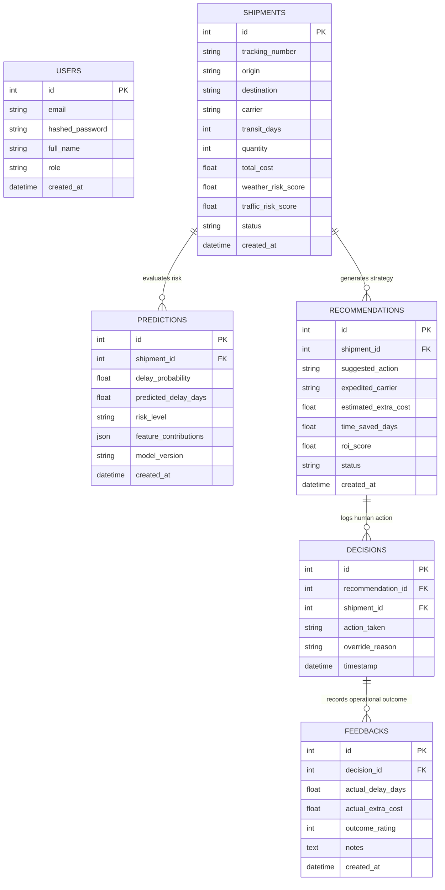

# Database Schema & Entity Design

SupplyPrescript uses SQLAlchemy ORM supporting PostgreSQL in production and SQLite for local development.

```mermaid
erDiagram
    USERS {
        int id PK
        string email
        string hashed_password
        string full_name
        string role
        datetime created_at
    }

    SHIPMENTS {
        int id PK
        string tracking_number
        string origin
        string destination
        string carrier
        int transit_days
        int quantity
        float total_cost
        float weather_risk_score
        float traffic_risk_score
        string status
        datetime created_at
    }

    PREDICTIONS {
        int id PK
        int shipment_id FK
        float delay_probability
        float predicted_delay_days
        string risk_level
        json feature_contributions
        string model_version
        datetime created_at
    }

    RECOMMENDATIONS {
        int id PK
        int shipment_id FK
        string suggested_action
        string expedited_carrier
        float estimated_extra_cost
        float time_saved_days
        float roi_score
        string status
        datetime created_at
    }

    DECISIONS {
        int id PK
        int recommendation_id FK
        int shipment_id FK
        string action_taken
        string override_reason
        datetime timestamp
    }

    FEEDBACKS {
        int id PK
        int decision_id FK
        float actual_delay_days
        float actual_extra_cost
        int outcome_rating
        text notes
        datetime created_at
    }

    SHIPMENTS ||--o{ PREDICTIONS : "evaluates risk"
    SHIPMENTS ||--o{ RECOMMENDATIONS : "generates strategy"
    RECOMMENDATIONS ||--o{ DECISIONS : "logs human action"
    DECISIONS ||--o{ FEEDBACKS : "records operational outcome"
```
