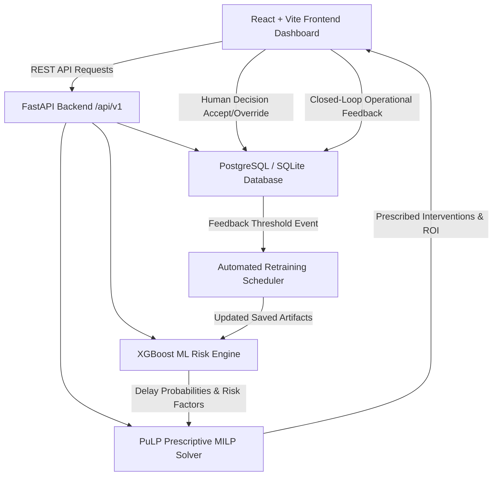

# System Architecture - SupplyPrescript

SupplyPrescript is an integrated closed-loop prescriptive analytics engine.

## System Workflow
1. **Shipment Ingestion**: Logistics Managers register shipment routes, quantities, weather indices, and traffic risk scores.
2. **Predictive Risk Assessment**: XGBoost evaluates disruption probability, risk tier (`LOW`, `MEDIUM`, `HIGH`, `CRITICAL`), and feature risk contributions.
3. **Prescriptive Strategy Formulation**: PuLP Linear Programming optimizes delay mitigation (air expedite, reroute, priority gate) subject to strict user budget constraints.
4. **Human-in-the-Loop PostgreSQL Audit**: Users accept or override recommendations with recorded business justification.
5. **Closed-Loop Learning**: Realized arrival outcomes and costs are fed back to automatically retrain prediction models.
